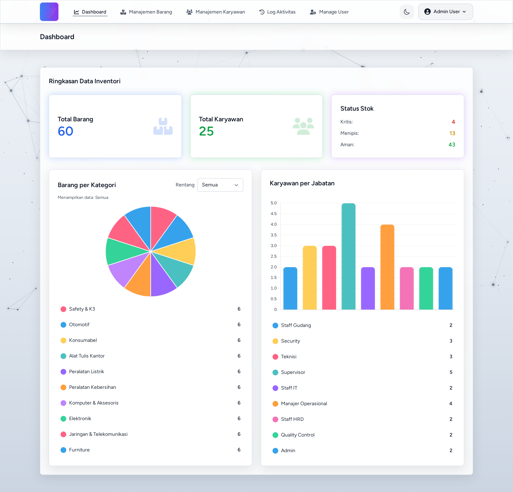
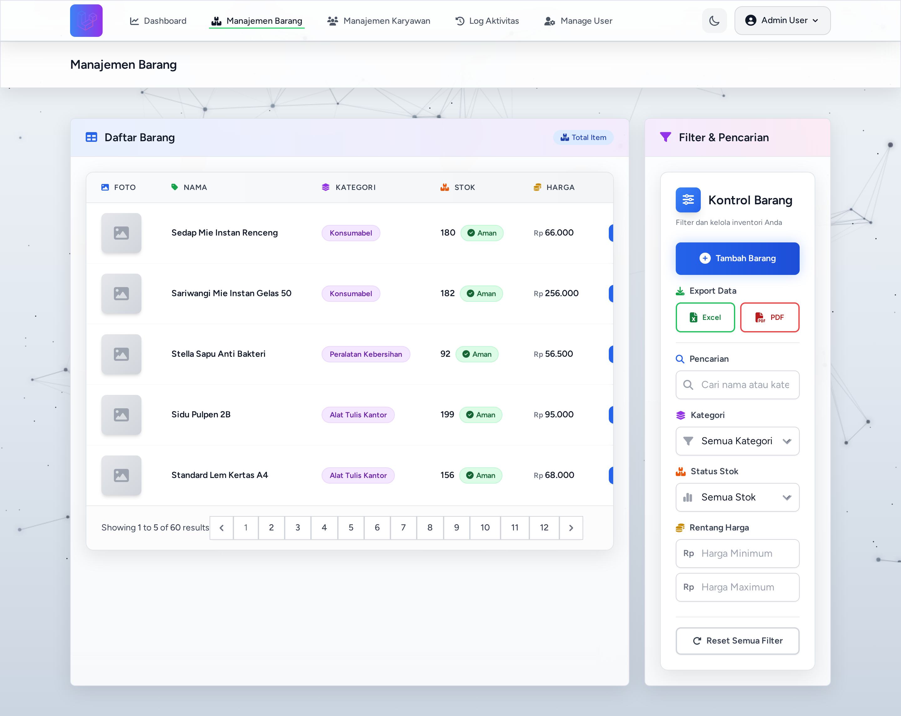
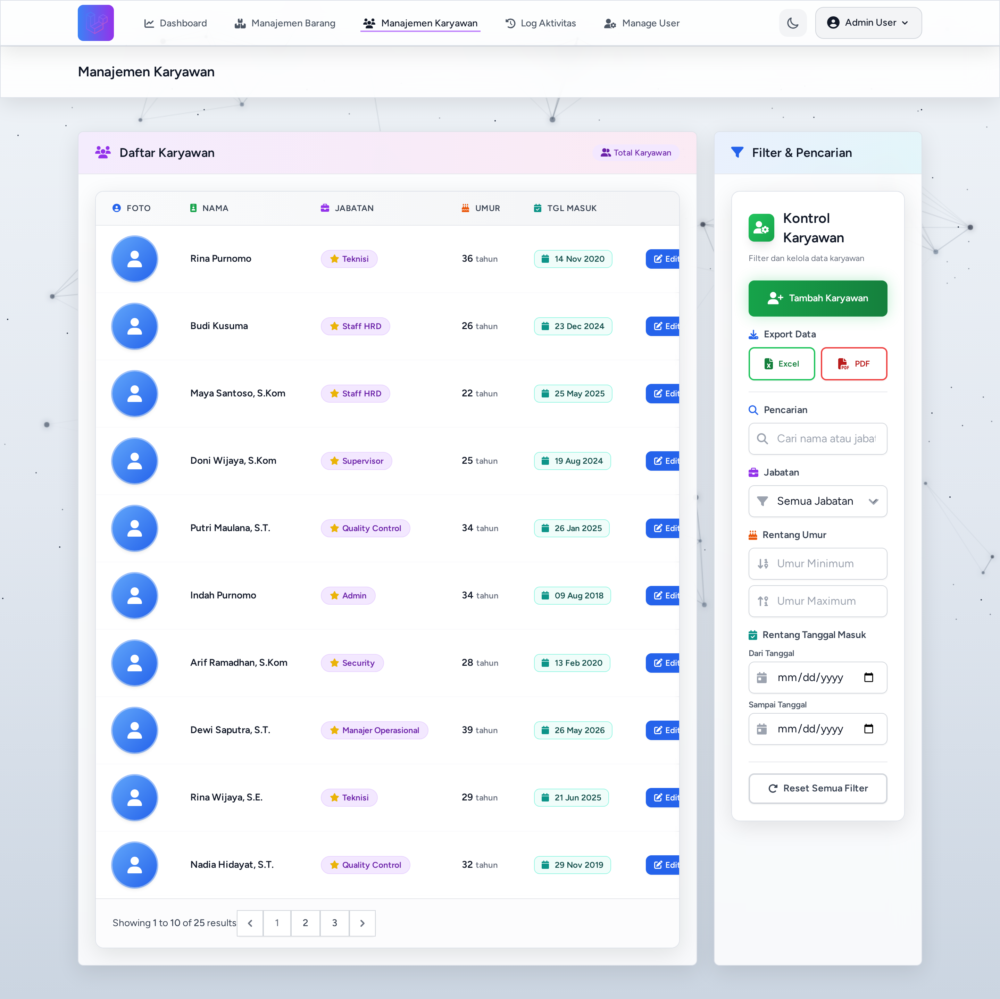

<div align="center">

# 📦 Inventory Management System

**A modern inventory & employee management system built with Laravel 12 and Livewire 3.**

Track stock items and employees, monitor inventory health from an interactive dashboard,
export reports to Excel/PDF, and keep a full audit trail — all behind a role-based access system.

[](https://laravel.com)
[](https://www.php.net)
[](https://livewire.laravel.com)
[](https://tailwindcss.com)
[](https://www.mysql.com)
[](https://www.docker.com)
[](#-license)

</div>

---

## 📖 About

**Inventory Management System** is a web application for managing warehouse stock (*barang*) and
employee records (*karyawan*) in one place. It was built to replace manual spreadsheet-based
record keeping with a centralized, auditable, and role-aware system.

The application ships with an interactive dashboard, real-time search & filtering, Excel/PDF
report exports, low-stock alerts, and an activity log that records who changed what and when.

---

## 🧰 Tech Stack

| Layer | Technology |
| :--- | :--- |
| **Language** | PHP 8.2+ |
| **Framework** | Laravel 12 |
| **Reactive UI** | Livewire 3 |
| **View / Styling** | Blade, Tailwind CSS, Vite |
| **Authentication** | Laravel Breeze (session-based, email verification) |
| **Charts** | Chart.js (pie & bar) |
| **Excel Export** | `maatwebsite/excel` |
| **PDF Export** | `barryvdh/laravel-dompdf` |
| **Audit Trail** | `spatie/laravel-activitylog` |
| **Database** | MySQL 8 (Docker) / SQLite (local default) |
| **Runtime (Docker)** | PHP-FPM + Nginx + MySQL |
| **Deployment** | Docker Compose, Railway, Heroku |

---

## ✨ Features

- **Interactive Dashboard** — totals for items & employees, stock-health breakdown
  (critical / low / safe), a pie chart of items per category with a time-range filter,
  and a bar chart of employees per position.
- **Item Management (Barang)** — full CRUD with photo upload, live search, and filters by
  category, stock status, and price range.
- **Employee Management (Karyawan)** — full CRUD with photo upload, auto-computed age,
  and filters by position, age range, and join date.
- **Role-Based Access Control** — `admin` and `staff` roles enforced via middleware.
- **Report Exports** — download item & employee reports as **Excel (.xlsx)** or **PDF**.
- **Activity Log** — every create/update/delete on items and employees is recorded, with
  filtering by user and date range (admins only).
- **User Management** — admins can create, edit, and delete users and assign roles.
- **Notifications** — queued notifications for low stock (< 5 units), new employees, and
  activity-log clearing, delivered to all administrators.
- **Responsive & Dark Mode** — clean Tailwind UI that works on desktop and mobile.

---

## 📸 Screenshots

### Dashboard
<p align="center">
  
</p>

### Item Management (Barang)
<p align="center">
  
</p>

### Employee Management (Karyawan)
<p align="center">
  
</p>

---

## 🔐 Roles & Permissions

| Capability | `staff` | `admin` |
| :--- | :---: | :---: |
| View dashboard | ✅ | ✅ |
| View / create / edit items | ✅ | ✅ |
| **Delete** items | ❌ | ✅ |
| Manage employees | ❌ | ✅ |
| Export reports (Excel / PDF) | ❌ | ✅ |
| Manage users & roles | ❌ | ✅ |
| View / clear activity log | ❌ | ✅ |

> New accounts registered through the public sign-up form are assigned the `staff` role by default.

---

## 🗃️ Data Model

| Table | Key Columns |
| :--- | :--- |
| `users` | `name`, `email`, `password`, `role` |
| `barangs` | `nama`, `kategori`, `stok`, `harga`, `deskripsi`, `foto` |
| `karyawans` | `nama`, `jabatan`, `tanggal_lahir`, `tanggal_masuk`, `foto` |
| `activity_log` | Spatie activity log (subject, causer, event, properties) |

**Stock status** is derived from `stok`: **critical** `< 5`, **low** `5–10`, **safe** `> 10`.
**Employee age** is not stored — it is computed from `tanggal_lahir` via an Eloquent accessor.

---

## 📂 Project Structure

```
inventory/
├── app/
│   ├── Exports/                 # BarangsExport, KaryawansExport (Excel)
│   ├── Http/Controllers/        # Barang, Karyawan, Dashboard, User, ActivityLog
│   ├── Livewire/                # Searchable tables, filters, forms, notifications
│   ├── Models/                  # Barang, Karyawan, User
│   ├── *Notification.php        # Queued notifications
│   ├── AdminNotifier.php        # Broadcast helper to all admins
│   └── RoleMiddleware.php       # 'role' middleware
├── database/
│   ├── migrations/
│   └── seeders/                 # DatabaseSeeder, BarangSeeder, KaryawanSeeder
├── docker/                      # nginx config + entrypoint
├── docs/                        # README screenshots
├── resources/views/             # Blade + Livewire views
├── routes/web.php
├── Dockerfile
├── docker-compose.yml
└── railway.toml / Procfile      # Deployment configs
```

---

## 🚀 Getting Started

### Prerequisites

- **Docker** (recommended), **or** for the local setup: PHP ≥ 8.2, Composer, Node.js ≥ 18, and a database.

---

### Option A — Docker (recommended)

```bash
git clone https://github.com/irfansss-03/inventory.git
cd inventory

cp .env.example .env

docker compose up -d --build
docker compose exec app php artisan key:generate
docker compose exec app php artisan migrate --seed
docker compose exec app php artisan storage:link
```

Open **http://localhost:4321**.

> The `app` container connects to the MySQL service automatically (`DB_HOST=db`), and the
> entrypoint runs pending migrations on start. `APP_KEY` is read from your `.env` file.

---

### Option B — Local (without Docker)

```bash
git clone https://github.com/irfansss-03/inventory.git
cd inventory

composer install
cp .env.example .env
php artisan key:generate
touch database/database.sqlite
php artisan migrate --seed
php artisan storage:link
npm install && npm run build
php artisan serve
```

Open **http://127.0.0.1:8000**.

> Shortcut: `composer run setup` then `composer run dev` (runs server + queue + Vite together).

---

### 🔑 Default Credentials

After seeding, log in with:

| Field | Value |
| :--- | :--- |
| **Email** | `admin@example.com` |
| **Password** | `password` |
| **Role** | `admin` |

> ⚠️ Change this password before deploying to production.

---

### 🌱 Sample Data

The seeders generate **realistic demo data automatically** (no hard-coded rows):

- `BarangSeeder` — **60 items** across **10 categories** (6 each), with randomized prices,
  varied stock levels (including some critical/low so the dashboard status is meaningful),
  and creation dates spread over the past ~11 months.
- `KaryawanSeeder` — **25 employees** with Indonesian names, positions, birth dates, and
  join dates (age is computed automatically).
- `DatabaseSeeder` — creates the admin account (email verified).

Seeders are **idempotent** — they skip tables that already contain data. To regenerate a
fresh random dataset:

```bash
php artisan migrate:fresh --seed
```

---

## ☁️ Deployment

The project ships with configs for container and PaaS deployments:

- **Docker Compose** — `app` (PHP-FPM) + `web` (Nginx, port `4321`) + `db` (MySQL, port `24434`).
- **Railway** — `railway.toml` runs `php artisan migrate --force` on release.
- **Heroku** — `Procfile` provided.

For production, set the following environment variables: `APP_ENV=production`, `APP_DEBUG=false`,
`APP_KEY`, `APP_URL`, and the `DB_*` credentials. Because notifications are queued
(`QUEUE_CONNECTION=database`), run a worker:

```bash
php artisan queue:work
```

---

## 👥 Authors

- [@irfansss-03](https://github.com/irfansss-03)

---

## 📄 License

This project is released under the **MIT License**, as declared in [`composer.json`](composer.json).

<div align="center"><sub>Built with Laravel & Livewire.</sub></div>
